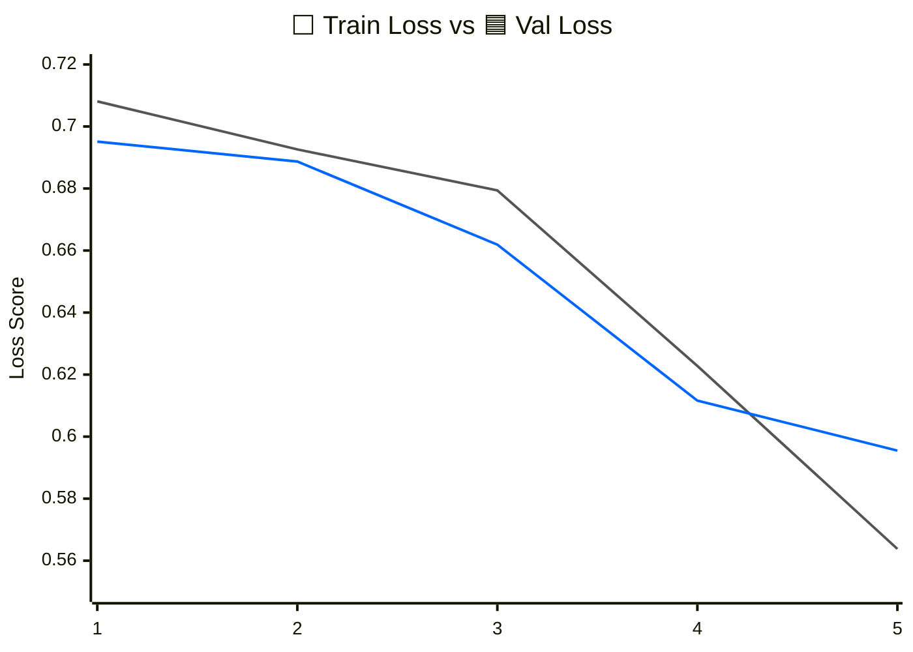
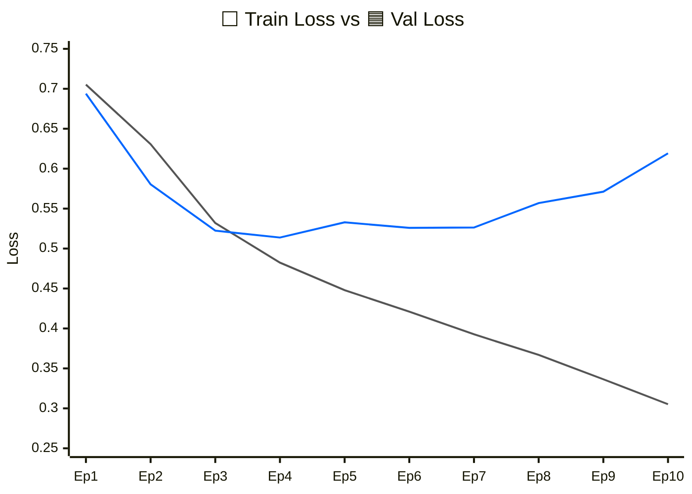
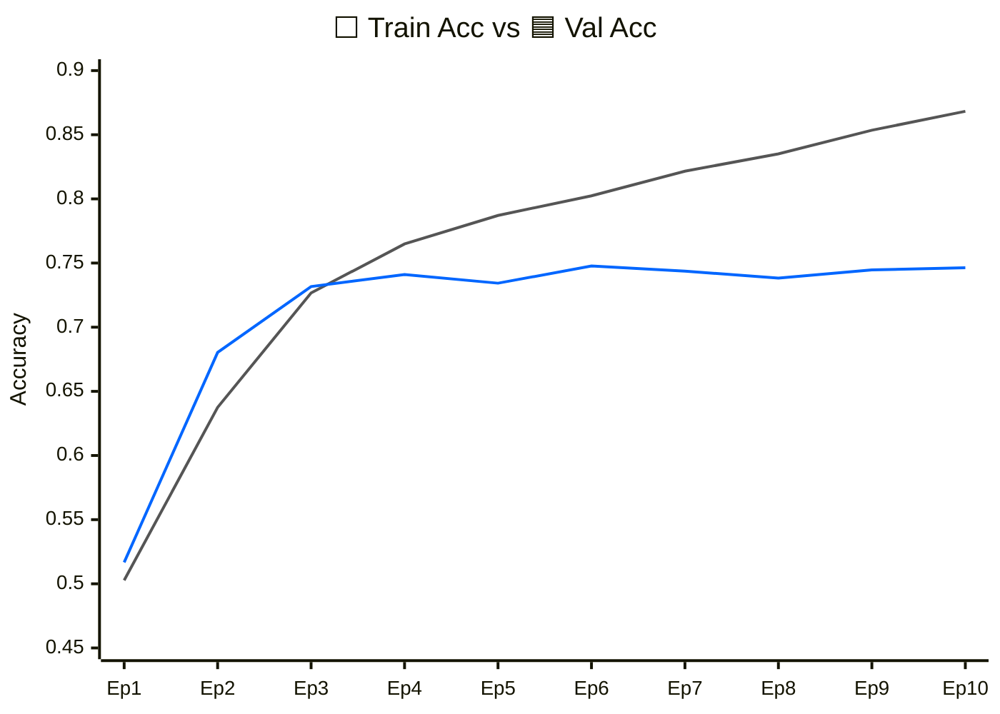
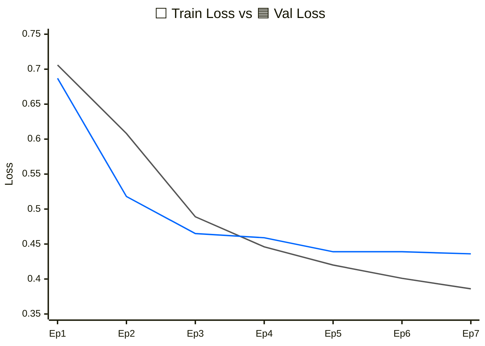
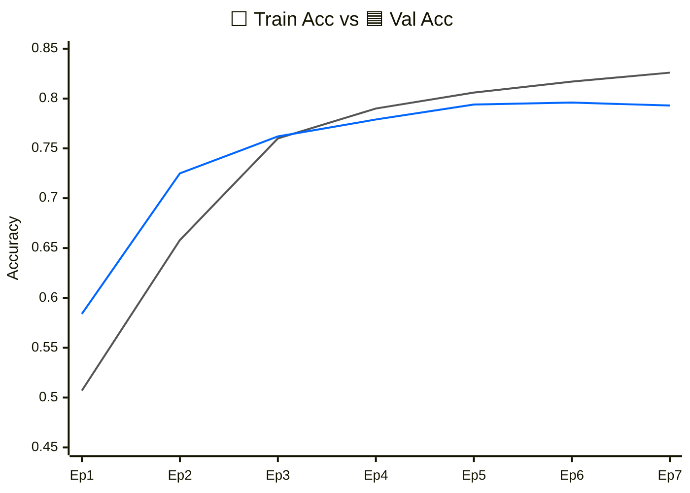

## 테스트 구현  

**1차: 초기 테스트**  
그래프 결과는 다음과 같다:  
리뷰 글을 보고 긍정/부정 문맥 파악하는 train 과정  
식: `loss = -log(p)`.. 95%(4.60) → 50%(0.69) → 25%(0.28) → 5%(0.05) → 1%(0.01)

한계점 분석:  
epoch는 현재 5번이 전부, train 데이터가 적음.. `train_data[:5000]`  
모델이 작음.. `emb_dim=64, n_layers=2`, corpus가 적음.. `corpus[:50000]`  
  
corpus란? → 초기 bpe 사전 만들 때 쓰는 원문 data 양(현 python 문자열 기준 5만 자)  
train_data랑 뭔 차이? → 학습하는 데이터 묶음: 현재 5천개의 리뷰만 학습함  
val과 train 차이? → 둘 다 loss를 산출하지만 train 쪽만 미분하여 모델이 갱신됨  

다음과 같이 스케일 업 시도:  
```
corpus_size = 300000
train_data_size = 20000
val_data_size = 3000
emb_dims = 128
layer_num = 3
epoch_num = 10
n_batch = 128 => 시간 단축을 위해
```
<br>

**2차: 스케일 업 테스트**  
그래프 결과(loss 기준):  

<br>  

그래프 결과(accuracy 기준):  


**과적합 상태**인가? .. 추정 중
왜 과적합이 발생하나? → 과도한 파라미터 or 너무 많은 epochs or 데이터 부족  
현재 train과 val의 그래프 방향이 다름: train의 지엽적인 특성을 패턴으로 인식함을 추정 가능  
  
*과적합의 예시를 말하자면?*  
개와 고양이 분류 모델: 흰색 고양이만 학습 자료로 제공 → 모델이 "흰색"도 기준요소로 학습  

train 쪽은 계속 좋아지는데 val은 정체되는 건: train 데이터에만 있는 지엽적 패턴까지 암기  
emb_dim, n_layers와 같이 모델 고도화 하는 것은 지엽적 패턴 암기 가능성을 더 높임  
  
다음과 같이 수정 방향 결정:
```
corpus_size = 500000 => 원본 사용량 늘리기
epoch_num = 7
drop_rate = 0.2 => 뉴런 사멸 빈도 높이기
train_data_size = 50000 => 학습 데이터를 늘려서 지엽적 패턴 학습 방지  
n_vacab = 2000 => 사전 크기를 늘리기
```
<br>  

**3차: 테스트**
그래프가 아닌 도표로 나타내고자 한다:
```
epoch  train_loss  train_acc  val_loss  val_acc
1      0.645       0.608      0.524     0.732
2      0.479       0.765      0.450     0.783
3      0.420       0.803      0.434     0.798
4      0.384       0.825      0.432     0.800
5      0.347       0.846      0.436     0.806
6      0.309       0.868      0.440     0.802
7      0.263       0.890      0.493     0.795
```
이번 테스트도 과적화가 3 회차 부터 뚜렷하게 관찰되었다.  
<br>

**조정값 분석**
corpus_size = tokenizer는 학습 시간에 큰 영향, GPU train 시간에는 직접 영향 無  

GPU 연산에 과부하를 주는 값들:  
vocab_size → (vocab_size x emb_dim)로 전체 파라미터 증가    
context_length → 문장 길이: attention 연산 제곱 증가 
train_data_size → 전체 batch 수가 늘어남(한 epoch for문 len 증가)  
layer_num → 계층 수 만큼 비례해서 연산량 증가: 모델이 더 깊어짐(과적합 의심 可)  
  
*모델 정교화 요인들*  
n_batch: 묶음이 클 수록 대량 병렬 연산으로 속도가 증가하나, gradient 섬세함 감소  

*과적합에 영향을 주는 정도 비교를 해보자*  
클 수록 과적합 증가: epoch_num, emb_dim, layer_num  
클 수록 과적합 적게 증가: context_length, vocab_size  
작을 수록 과정합 증가: train_data_size  
  
*과적합은 이론상 모든 모델에서 발생 가능하다*  
무한하지 않은 데이터로 학습 시, 이론 상 과적합은 발생 가능. 이론을 정리하자면:  
**보편적 근사 정리**: 은닉층이 많을 수록 train 패턴 완벽 모방 가능  
.. 표현 능력에 제약을 걸 경우, 지엽적 노이즈를 버림(현: 굵진한 문맥 흐름만 파악)  
**차원의 저주**: 현 학습은 단어 2000개(2000차원) → 128차원으로 줄이는 과정  
.. 2000차원에서 단어는 2만개이니, 공간에 점이 너무 적음: 의미적 지도 그리기 어려움
.. 이런 상황에서 단순 암기하는 기조가 현성이 됨    
**바이어스-분산 trade off**: 학습 진행 시, 오차는 줄지만 새 데이터 변동성 증가
.. 바이어스: 모델이 규칙을 몰라 발생하는 원천적 오차(bias)  
.. 분산: 사소한 노이즈 까지 규칙으로 파악, 낯선 문제가 오면 엉뚱한 값 출력하는 것  
.. 분산과 바이어스 모두 낮게 만드는 것이 이상적, 이 둘은 시소 관계  
<br>

**수정 제안: 수학적으로 훑어보기** 
2000차원에 2만개 단어(vocab_size)는 작다: 6만개로 확장.. why? → 수학적으로 보자:  
단어장 2000개에서 단어 2개가 형성 가능한 최대 조합: 200만 개
학습 데이터(문장)은 2만 개(문장 당 45개의 pair = 90만 조합.. 유효한 조합: 약 10만)  

*왜 유효한 조합이 적을까?*  
중복 조합: (영화, 진짜), (너무, 보고) → 긍정/부정 변별 없음, 문맥 영향 안줌  
유효 조합: (개연성, 꽝), (시간, 순삭) → 부정 맥락 파악 가능, 긍정 표현 파악 가능  
  
→ 이로 인해 128차원이 유의미한 정보로 채워지지 못하고 사소한 디테일을 채움(노이즈)  
<br>

**N차: 테스트**  
그래프 결과(loss 기준):  

<br>  

그래프 결과(accuracy 기준):  


과적합 상태가 개선되었음을 확인이 가능하다.  
조정한 값든은 다음과 같다:  
```
A. 실험 환경 설정: corpus_size = 400000

1. 학습용 데이터: train_data_size = 60000
2. 시험용 데이터: val_data_size = 3000
3. 어휘 사전 크기: n_vacab = 2000

a. 차원 수: emb_dims = 128
b. 계층 수: layer_num = 2
c. 드롭 비율: n_droprate = 0.3

x. 회차 횟수: epoch_num = 7
y. 묶음 양: n_batch = 256
z. 보조 cpu 프로세서: n_workers = 2
```

